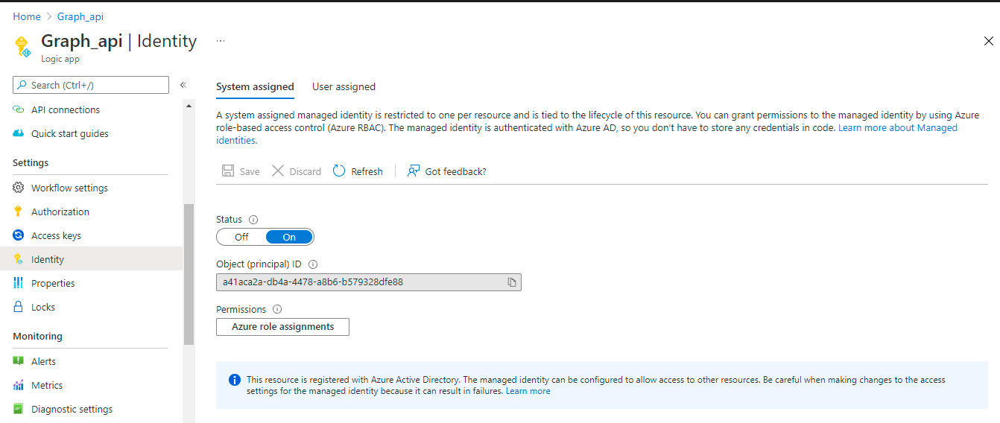
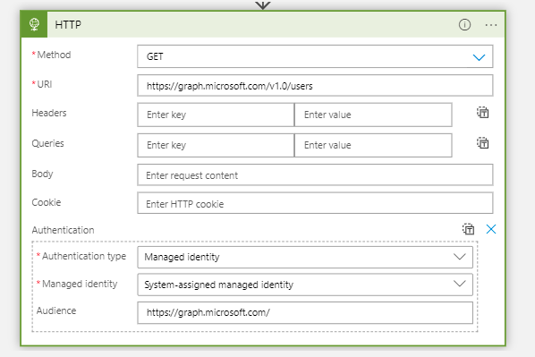

# How to call Graph api from Logic app using Managed Identity

This article describe you How to use Managed Identity to call Graph API

# Enable Managed Identity for Logic App 



# Grant access to Microsoft Graph

When accessing the Microsoft Graph, the managed identity needs to have proper permissions for the operation it wants to perform. Currently, there's no option to assign such permissions through the Azure portal. The following script will add the requested Microsoft Graph API permissions to the managed identity service principal object.

```
az login

spId='a41aca2a-db4a-4478-a8b6-b579328dfe88'

graphResourceId=$(az ad sp list --display-name "Microsoft Graph" --query [0].objectId --out tsv)

appRoleId=$(az ad sp list --display-name "Microsoft Graph" --query "[0].appRoles[?value=='User.Read.All' && contains(allowedMemberTypes, 'Application')].id" --output tsv)

uri=https://graph.microsoft.com/v1.0/servicePrincipals/$spId/appRoleAssignments

body="{'principalId':'$spId','resourceId':'$graphResourceId','appRoleId':'$appRoleId'}"

az rest --method post --uri $uri --body $body --headers "Content-Type=application/json"

```
# Use Managed Identity while calling HTTP action in Azure Logic App


